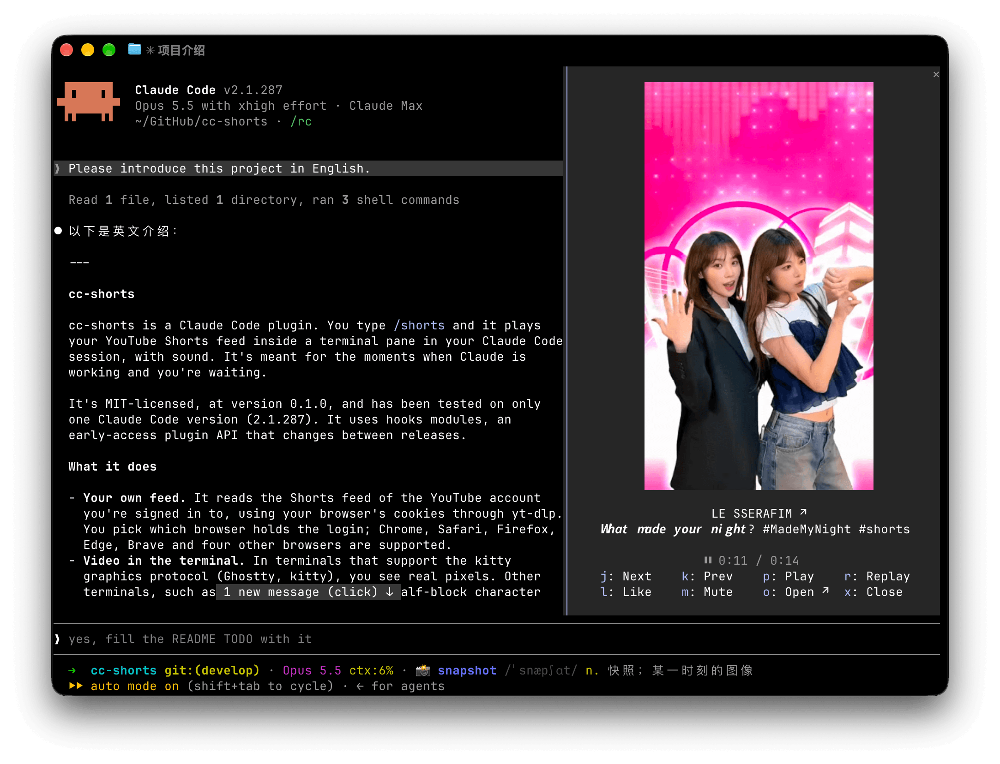

# cc-shorts



`/shorts` Play YouTube Shorts in your Claude Code 💃

> **Early.** cc-shorts works on Claude Code 2.1.287, the one version tested so far. It runs on hooks modules, an early-access plugin API that changes between releases, so another version may fail to load it.

## Requirements

- **macOS.** cc-shorts plays sound through ffmpeg's AudioToolbox device and switches the macOS input source.
- **Claude Code in a terminal.** The desktop app and IDE extensions do not play the pane. Terminals with the kitty graphics protocol (Ghostty, kitty) show real pixels; the rest (iTerm2, tmux, …) get half-block characters.
- **yt-dlp**, from Homebrew, pipx or pip.
- **ffmpeg** with the `audiotoolbox` output device. Homebrew's ffmpeg has it.
- **deno**, recommended: yt-dlp solves YouTube's JavaScript challenges with it and may miss formats without it.
- **A browser signed in to YouTube**: Chrome, Safari, Edge, Firefox, Brave, Opera, Vivaldi, Chromium or Whale. cc-shorts reads your feed with that browser's cookies, and YouTube serves no Shorts feed to a signed-out visitor. yt-dlp cannot read Arc.

The first `/shorts` checks for these tools and offers to have Claude install the missing ones (see [First run](#first-run)). To install them yourself with Homebrew:

```sh
brew install yt-dlp ffmpeg   # Homebrew's yt-dlp brings deno along
```

## Install

From Claude Code:

```
/plugin marketplace add mthli/cc-shorts
/plugin install cc-shorts@cc-shorts
```

Then start a new session. Claude Code loads the plugin once you trust the folder the session runs in.

Or run it from a clone:

```sh
git clone https://github.com/mthli/cc-shorts.git
claude --plugin-dir /path/to/cc-shorts
```

## First run

1. **The setup check.** Each session checks for yt-dlp, ffmpeg and deno in the background and toasts what is missing. While yt-dlp or ffmpeg is missing, `/shorts` asks whether Claude should install them (with `brew install …`) instead of opening the pane. Claude's commands go through your permission settings like any others. The install prompt tells Claude to leave Homebrew's "taps are not trusted" warning alone (no `brew trust`, no `brew untap`), and to stop and tell you when something needs `sudo` or your password.
2. **The browser.** The first `/shorts` asks which browser you are signed in to YouTube with, offering the ones you have used on this Mac. Run `/shorts browser` to change it later.
3. **Access to the cookies.**
   - Chrome, Edge, Brave and the other Chromium browsers: macOS asks to let the `security` tool, which yt-dlp runs, read the browser's "Safe Storage" key from the Keychain. **Allow** grants one read, so the prompt returns for each feed request, like and watch-history report. **Always Allow** ends the prompts, and from then on any program that runs `security` can read that key without asking.
   - Firefox needs no grant.
   - Safari keeps its cookies where only an app with **Full Disk Access** can read them (System Settings › Privacy & Security); Files & Folders does not reach them. You grant it to your terminal app, and everything the terminal runs gets it too. If that is too broad, pick another browser.

## Keys

While the pane has the keyboard, it switches macOS to an English layout so an input method cannot swallow these keys:

| Key | Does                                     |
| --- | ---------------------------------------- |
| `j` | Next Short                               |
| `k` | Previous Short, from the start           |
| `p` | Pause / play                             |
| `r` | Replay from the start                    |
| `l` | Like / unlike, on your account           |
| `m` | Mute / unmute                            |
| `o` | Pause and open the Short in your browser |
| `x` | Close the pane                           |

The author's name under the video opens the Short too. Closing the pane keeps your place for the rest of the session, so the next `/shorts` resumes the same Short.

## What it does with your account

- **It reads your feed** through YouTube's internal web API (the Shorts sequence the website scrolls), with your browser's cookies. That API is unofficial and may break whenever YouTube changes it.
- **It writes to your account.** cc-shorts adds a Short to your watch history once you have watched 10 seconds of it (half of one under 20 seconds), as the website does. `l` likes and unlikes.
- **It goes against YouTube's Terms of Service**, as any automated client signed in as you does, and that puts the account at risk. cc-shorts keeps its requests near a person's scrolling pace: about 15 Shorts per batch, and the next batch once 5 are left.
- **Your cookies stay on your Mac.** yt-dlp reads them locally and sends them only to YouTube. cc-shorts downloads Shorts at most 480 pixels wide, five ahead of the one playing, into a temporary folder (`$TMPDIR/cc-shorts/`), and deletes them when the pane closes or the session ends.

## When something goes wrong

The pane says what failed:

- **"Could not get the feed (signed out: no YouTube login in …)"**: sign in to YouTube in that browser, or switch with `/shorts browser`.
- **"Could not get the feed (cannot read …'s cookies: …)"**: with Safari, give your terminal Full Disk Access. With Chrome or another Chromium browser, press `j` and answer the Keychain prompt with **Allow**. A browser you have never used on this Mac has no cookies; switch with `/shorts browser`.
- **"Downloads keep failing"**: check the network, then press `j`.
- **cc-shorts says a tool is missing, but you installed it**: cc-shorts looks for tools on Claude Code's own `PATH`, and a tool outside it counts as missing.

YouTube changes its site often, and yt-dlp keeps up in new releases: `brew upgrade yt-dlp` (or `pipx upgrade yt-dlp`) fixes most breakage. cc-shorts relies on some yt-dlp internals too, so a new yt-dlp can break cc-shorts until cc-shorts ships an update.

## Development

```sh
claude plugin test .                              # tests
claude plugin validate .claude-plugin/plugin.json # the plugin and its hooks module
claude plugin validate .                          # the marketplace: with marketplace.json here, `.` checks only that
bunx -p typescript tsc -p . --noEmit              # types; .claude-plugin/types/ appears once Claude Code has loaded the plugin
bunx prettier@3 --write hooks tests types         # format TypeScript (.prettierrc.json)
uvx ruff format helper                            # format Python (ruff.toml)
```

`claude --plugin-dir .` reloads the plugin on every save. [`docs/research.md`](docs/research.md) holds the product decisions, the research behind them and the verification log; `.claude/maps/` explains how the code works.

## License

```
MIT License

Copyright (c) 2026 Matthew Lee
```
